<p align="center">
  
  
  
  
  
  
</p>

- [Purpose](#purpose)
- [Overview](#overview)
- [Installation](#installation)
- [Introduction](#introduction)
- [Examples](#examples)
  - [A toy Travelling Salesman Problem](#a-toy-travelling-salesman-problem)
  - [A Simulated Annealing approach to sorting a list of numbers](#a-simulated-annealing-approach-to-sorting-a-list-of-numbers)
  - [A Genetic Algorithm approach to guessing a string](#a-genetic-algorithm-approach-to-guessing-a-string)
- [Command Line Interface](#command-line-interface)
  - [Chaining](#chaining)
    - [Nearest Neighbor, Simulated Annealing and 2-Opt](#nearest-neighbor-simulated-annealing-and-2-opt)
    - [Eccentricity Comparison, Genetic Algorithm and 2-Opt](#eccentricity-comparison-genetic-algorithm-and-2-opt)
  - [Autocompletion](#autocompletion)
- [Theoretical Background](#theoretical-background)
  - [Greedy Approaches](#greedy-approaches)
    - [Nearest Neighbor Search](#nearest-neighbor-search)
  - [Geometric Approaches](#geometric-approaches)
    - [Angle Comparison](#angle-comparison)
    - [Eccentricity Comparison](#eccentricity-comparison)
  - [Local Search Approaches](#local-search-approaches)
    - [2-opt](#2-opt)
  - [Meta-heuristic Approaches](#meta-heuristic-approaches)
    - [Genetic Algorithm](#genetic-algorithm)
    - [Simulated Annealing](#simulated-annealing)
    - [Compressed Annealing](#compressed-annealing)
  - [A Comprehensive Study of the Travelling Salesman Problem](#a-comprehensive-study-of-the-travelling-salesman-problem)
- [License](#license)

## Purpose

**[pytsp](./pytsp/)** aims at tackling the Travelling Salesman Problem in Python.

_What is the Travelling Salesman Problem ?_

- The travelling salesman problem (TSP) asks the following question: "Given a list of cities and the distances between each pair of cities, what is the shortest possible route that visits each city and returns to the origin city?"
- TSP can be modelled as an undirected weighted graph, such that cities are the graph's vertices, paths are the graph's edges, and a path's distance is the edge's weight. It is a minimization problem starting and finishing at a specified vertex after having visited each other vertex exactly once.

_If you are interested in the intricate inner workings of the different algorithms mentioned above, feel free to check out the [theoretical background](#theoretical-background) section._

## Overview

The project consists of

- the **[pytsp](./pytsp/)** library, which provides various approaches in tackling the Travelling Salesman Problem (with and without Time Windows). These include
  - Greedy approaches
    - [Nearest Neighbor Search](./pytsp/core/tsp.py#L118)
  - Geometric approaches
    - [Angle Comparison](./pytsp/core/tsp.py#L151)
    - [Eccentricity Comparison](./pytsp/core/tsp.py#L151)
  - Local Search approaches
    - [2-opt](./pytsp/core/tsp.py#L176)
  - Meta-heuristic approaches
    - [Genetic Algorithm](./pytsp/core/genetic.py#L8)
    - [Simulated Annealing](./pytsp/core/annealing.py#L17)
    - [Compressed Annealing](./pytsp/core/annealing.py#L64)

- the **[tsplot](pytsp/tsplot.py#L68)** command line utility, which can be used to demonstrate, compare and chain the various algorithms mentioned above.

## Installation

<div align="center">
  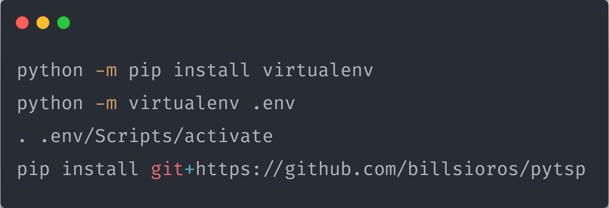
</div>

## Introduction

_What is a **Model** ?_

A **[Model](./pytsp/core/util/model.py#L41)** describes a set of distinctive qualities (_traits_) of each algorithm that can be inherited and/or assigned.

_What are **Traits** ?_

**[Traits](./pytsp/core/util/model.py#L42)** provide a frictionless way of modifying the inner workings of the underlying algorithms.

_Could you guess what the following python code will produce as output ?_

```python
from pytsp import Model


class Greet(Model):
    class Traits:
        class Greet:
            def greetings(self, name):
                return f'Greetings {self.title}{name}'

            def hello(self, name):
                return f'Hello {self.title}{name}'

    def __init__(self, title, *args, **kwargs):
        super().__init__(*args, **kwargs)

        self.title = title


def good_evening(self, name):
    return f'Good evening {self.title}{name}'


if __name__ == '__main__':
    greet = Greet('Mr.', greet='hello')

    print(greet.greet('Sioros'))

    greet.title = 'Sir.'
    greet.greet = 'greetings'

    print(greet.greet('Vasileios'))

    greet.title = ''
    greet.greet = good_evening

    print(greet.greet('Vasilis'))
```

If you answered

  Hello Mr.Sioros
  Greetings Sir.Vasileios
  Good evening Vasilis

you have earned yourself a cookie !

## Examples

Let's now look at some examples of using **pytsp**. The examples are presented in least to most confusing order.

_The following examples are simplified versions of a subset of the examples provided in the **[examples](./examples/)** directory._

### A toy Travelling Salesman Problem

```python
from random import uniform

from pytsp import TravellingSalesman

if __name__ == '__main__':
    x_axis, y_axis = (-50, +50), (-50, +50)

    cities = [
        (uniform(x_axis[0], x_axis[1]), uniform(y_axis[0], y_axis[1]))
        for i in range(10)
    ]

    depot, cities = cities[0], cities[1:]

    tsp = TravellingSalesman(metric='euclidean')

    route, cost = tsp.nearest_neighbor(depot, cities)
```

### A Simulated Annealing approach to sorting a list of numbers

```python
from random import choice, random, randrange, shuffle

from pytsp import SimulatedAnnealing


class Sort(SimulatedAnnealing):
    class Traits:
        class Mutate:
            def shift_1(self, elements):
                neighbor = elements[:]

                i = randrange(0, len(elements))
                j = randrange(0, len(elements))

                neighbor.insert(j, neighbor.pop(i))

                return neighbor

        class Cost:
            def ordered(self, individual):
                mispositioned = 0
                for i in range(0, len(individual) - 1):
                    for j in range(i + 1, len(individual)):
                        mispositioned += individual[i] > individual[j]

                return mispositioned


if __name__ == '__main__':
    sorter = Sort(mutate='shift_1', cost='ordered')

    individual = list(range(10))

    shuffle(individual)

    best, cost = sorter.fit(individual)
```

### A Genetic Algorithm approach to guessing a string

```python
from random import choice, random, randrange
from string import printable

from pytsp import GeneticAlgorithm


class GuessString(GeneticAlgorithm):
    class Traits:
        class Mutate:
            def randomize(self, individual):
                return ''.join([
                    choice(printable)
                    if random() < self.per_character_mutation_probability
                    else individual[i]
                    for i in range(len(individual))
                ])

        class Crossover:
            def cut_and_stitch(self, individual_a, individual_b):
                left = individual_a[:len(individual_a) // 2]
                right = individual_b[len(individual_b) // 2:]

                return left + right

        class Select:
            def random_top_half(self, population):
                return population[randrange(0, len(population) // 2)]

        class Fitness:
            def least_squares(self, individual):
                squared_sum = 0
                for i in range(len(self.target)):
                    squared_sum += (ord(individual[i]) - ord(self.target[i])) ** 2

                return 1 / (squared_sum + 1)

    def __init__(self, target, *args, per_character_mutation_probability=0.1, **kwargs):
        super().__init__(*args, **kwargs)

        self.target = target
        self.per_character_mutation_probability = per_character_mutation_probability


if __name__ == '__main__':
    target = 'Hello World!'

    string_guesser = GuessString(
        target,
        mutate='randomize',
        crossover='cut_and_stitch',
        select='random_top_half',
        fitness='least_squares',
        max_iterations=10000
    )

    individual = ''.join([choice(printable)for _ in range(len(target))])

    fittest = string_guesser.fit(individual)
```

## Command Line Interface

**tsplot** provides a means of demonstrating, comparing and chaining different algorithms.

<div align="center">
  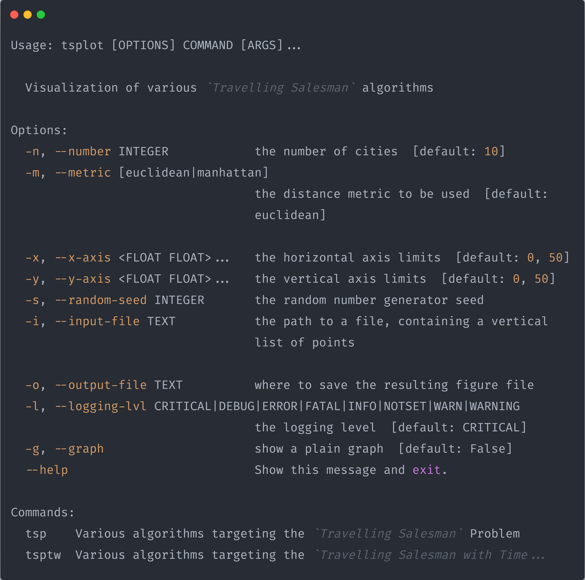
</div>

_Apart from the main options showcased above, each sub-command has its own sub-options, which can be viewed with the `--help` flag, as such_

<div align="center">
  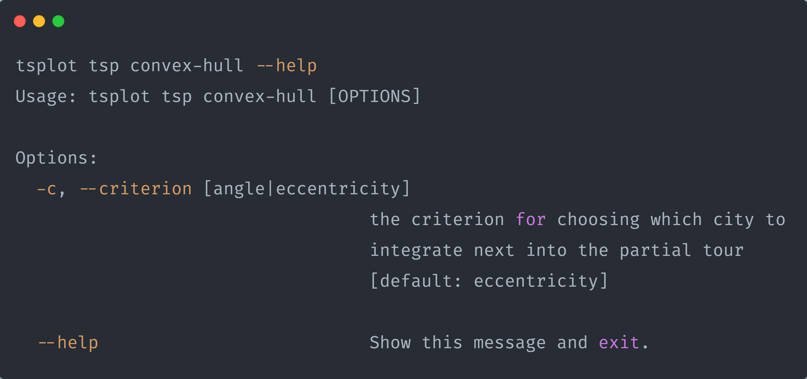
</div>

_We are going to focus on `chaining` different algorithms, as simpler cases are demonstrated in the [theoretical background](#theoretical-background) section anyway._

### Chaining

`Chaining` refers to passing the solution produced by the algorithm at hand as input to the algorithm following, so that it can be further improved.

#### Nearest Neighbor, Simulated Annealing and 2-Opt

<div align="center">
  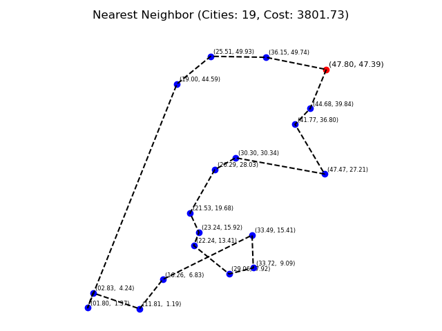
  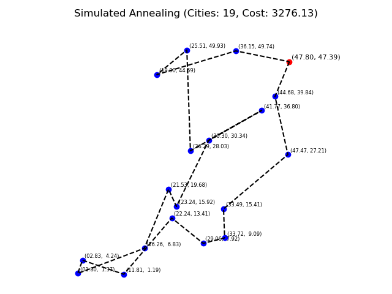
  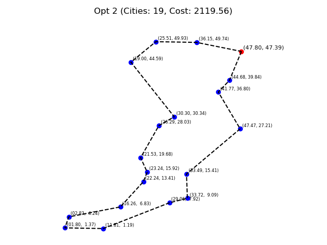
</div>

```bash
tsplot -n 20 -s 2 -g tsp nearest-neighbor simulated-annealing opt-2
```

#### Eccentricity Comparison, Genetic Algorithm and 2-Opt

```bash
tsplot -n 20 -s 0 -g tsp convex-hull genetic-algorithm opt-2
```

<div align="center">
  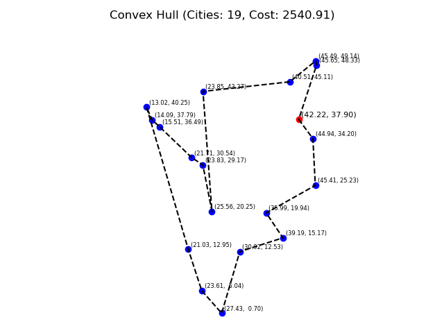
  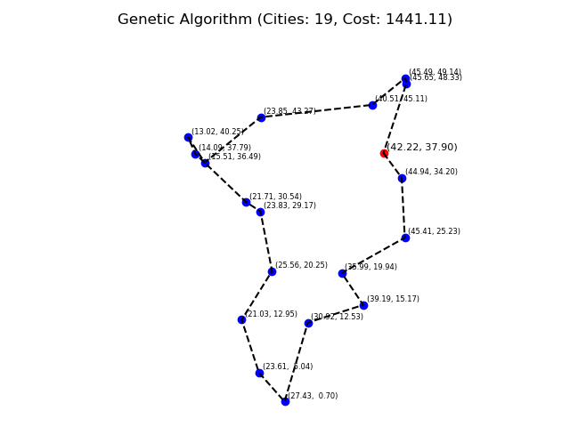
  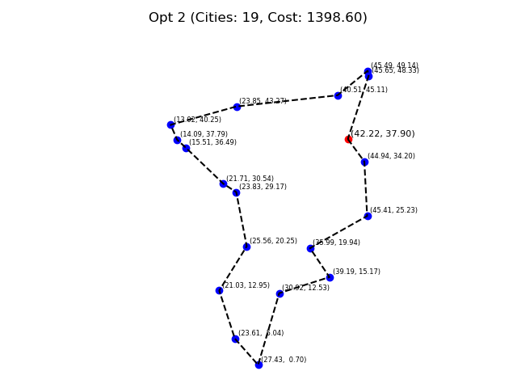
</div>

### Autocompletion

**tsplot** is a [Click](https://click.palletsprojects.com/en/7.x/) based application, which means that enabling the autocompletion of its' sub-commands and options can be achieved as simply as adding a line to your `.*rc` file. To be more specific, when it comes to `bash` adding the following line to your `.bashrc` file will do exactly that.

```bash
eval "$(_TSPLOT_COMPLETE=source_bash tsplot)"
```

For more information, on enabling tab completion on different shells, please refer [here](https://click.palletsprojects.com/en/7.x/bashcomplete/).

## Theoretical Background

_Special thanks to [Andrinopoulou Christina](https://github.com/ChristinaAndrinopoyloy) for her major contribution in the theoretical research of the problem._

_In the following sections the terms `path`, `tour`, `route` are used interchangeably_

### Greedy Approaches

#### Nearest Neighbor Search

1. Initialize all vertices as unvisited.
2. Select an arbitrary vertex, set it as the current vertex and mark as visited.
3. Find out the shortest edge connecting the current vertex and an unvisited vertex.
4. Set the unvisited vertex as the current vertex and mark it as visited.
5. If all the vertices in the domain are visited, then terminate. Otherwise, go to step 3.

The sequence of the visited vertices is the output of the algorithm.

<div align="center">
  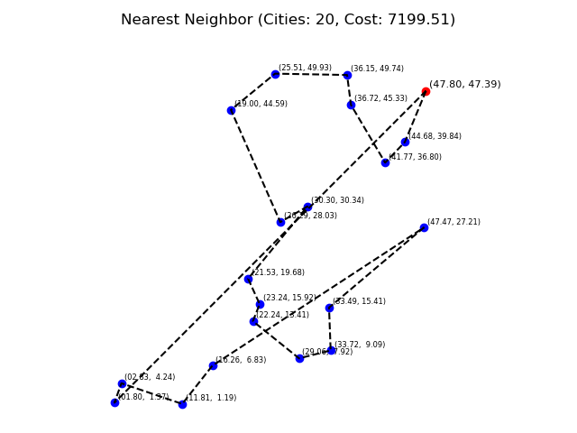
</div>

```bash
tsplot -n 20 -s 2 -g tsptw nearest-neighbor
```

### Geometric Approaches

#### Angle Comparison

1. Given a set of vertices, construct a partial tour consisting of the convex hull of the set and set the vertices that the convex hull is consisting of as visited.
2. While there are unvisited vertices do the following
   1. Given triplets of the form (_a_, _b_, _c_), where _a_ and _c_ correspond to consecutive vertices of the partial tour and _b_ to an unvisited vertex, calculate every angle that is formed by such a triplet.
   2. Find the triplet, corresponding to the maximal angle value, and insert the unvisited vertex belonging to the triplet between the consecutive vertices of the partial tour that belong in the triplet.

Yet again, the sequence of the visited vertices is the output of the algorithm.

<div align="center">
  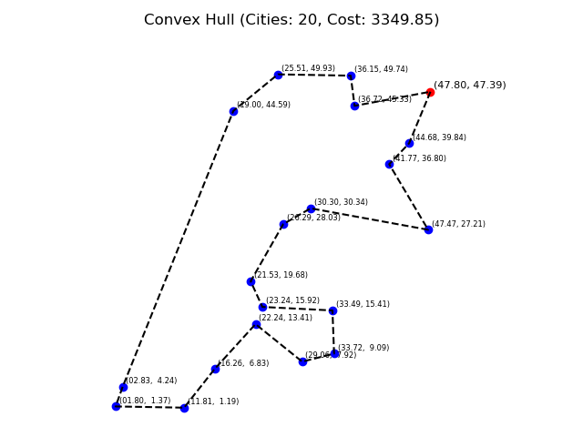
</div>

```bash
tsplot-n 20 -s 2 -g tsptw convex-hull -c angle
```

#### Eccentricity Comparison

This algorithm is quite similar to the angle comparison method mentioned above.

In fact, the only difference is that, we use the notion of _ellipses_. To be more specific, triplets of the aforementioned structure are formed, in each iteration of the algorithm, such that vertices _a_ and _c_ are the focal points of the ellipse and vertex _b_ intersects with the ellipse at hand.

Now the vertices are not inserted into the partial tour in maximal angle order. Instead, they are inserted in maximal ellipse eccentricity order, which is calculated as such

<div align="center">
   
</div>

<div align="center">
  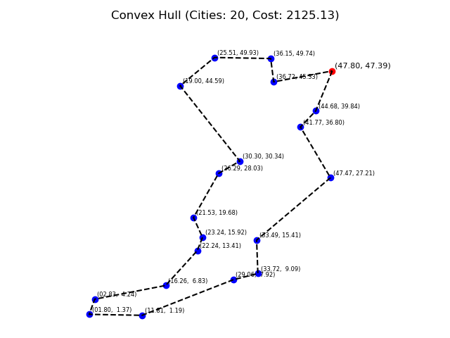
</div>

```bash
tsplot -n 20 -s 2 -g tsptw convex-hull -c eccentricity
```

### Local Search Approaches

#### 2-opt

The main idea behind it is to take a route that crosses over itself and reorder it so that it does not.

Given a route of length `n`, i.e. an ordering of the vertices, the 2-opt swapping mechanism performs the following

1. Initialize _new_route_ to be a new empty route.
2. Take the elements from index `0` to index `i - 1` and add them in order to _new_route_.
3. Take the elements from index `i` to index `k` and add them in reverse order to _new_route_.
4. Take the elements from index `k + 1` to `n` and add them in order to _new_route_
5. Return _new_route_ as a new candidate route

The actual algorithm utilizing the mechanism explained above performs the following

1. Assign the initially provided route as the best found route
2. Until no better solution can be found
   1. Calculate the cost of the best found route
   2. For every possible pair `(i, k)`
      1. Find a new candidate route, using the 2-opt swapping mechanism
      2. Calculate the candidate route's cost
      3. If the candidate route' cost is smaller than the cost of the best route thus far, restart the whole procedure, with the candidate route as the initially provided route.
   3. If the set of possible `(i, k)` pairs is exhausted, return the best found route.

<div align="center">
  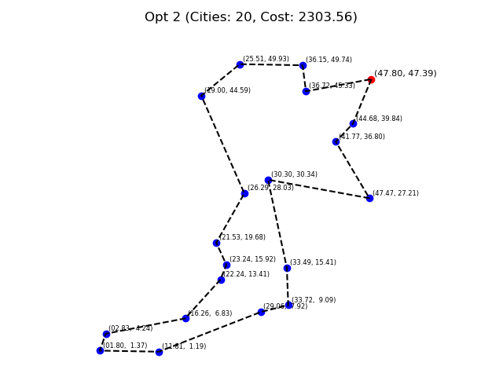
</div>

```bash
tsplot-n 20 -s 2 -g tsptw opt-2
```

### Meta-heuristic Approaches

_In this section, only a high level overview of the algorithms is going to be provided, as the exact steps of each algorithm are of miniscule importance, when compared to the mechanisms performing the `mutatation`, `selection`, `crossover`, `fitness` assessment, e.t.c of individuals._

_The mechanisms concerning the **Travelling Salesman Problem** are self explanatory and provide a solid start in tackling other combinatorial optimization problems_

#### Genetic Algorithm

Given an individual, the genetic algorithm performs the following

1. Generate the initial generation of `n` individuals, by means of mutation on the provided individual
2. While the maximum number of iterations has not been reached
   1. Calculate the fitness of all individuals belonging to the current generation
   2. If an individual with a fitness value higher than the one of the fittest individual thus far exists, assign it as the fittest individual
   3. If the fitness of the fittest individual thus far exceeds the fitness threshold, return it.
   4. Otherwise, until the next generation contains `n` individuals
      1. Select 2 individuals belonging to the current generation
      2. Cross them over in order to produce an offspring
      3. Probabilistically mutate the offspring
      4. Add the offspring to the next generation
3. Return the fittest individual

<div align="center">
  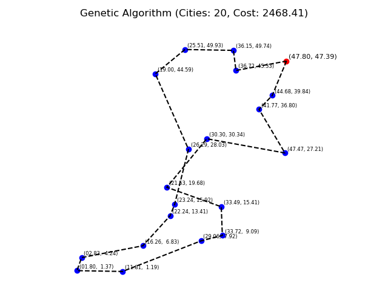
</div>

```bash
tsplot -n 20 -s 2 -g tsptw genetic-algorithm
```

#### Simulated Annealing

Given an initial solution, a cooling rate and an initial temperature, the simulated annealing heuristic performs the following

1. Let the current solution be the initial solution as well as the best solution so far
2. While the maximum number of iterations has not been reached and the current temperature is greater than 0
   1. Generate a new candidate solution and calculate its cost
   2. Probabilistically decide to accept the candidate solution as the current solution whilst taking into consideration the temperature, the current solution's cost as well as the candidate solution's cost
   3. If the candidate solution's cost is smaller than the best so far solution's cost, assign the candidate as the best found solution thus far
   4. Increase the number of iteration by 1
   5. Reduce the temperature by a factor of 1 - cooling rate
3. Return the best found solution

<div align="center">
  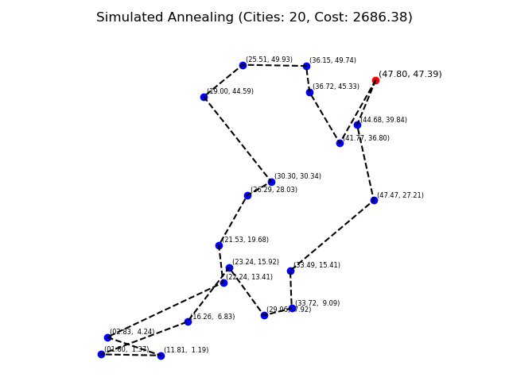
</div>

```bash
tsplot -n 20 -s 2 -g tsptw simulated-annealing
```

#### Compressed Annealing

_A variant of Simulated Annealing incorporating a variable penalty method to solve the **Travelling Salesman Problem with Time Windows**. Augmenting temperature from traditional Simulated Annealing with the concept of pressure (analogous to the value of the penalty multiplier), compressed annealing relaxes the time-window constraints by integrating a penalty method within a stochastic search procedure._

Sadly, `Compressed Annealing` can not be presented in the context of a brief theoretical overview, as it is indeed quite complex.

For anyone interested in achieving a greater theoretical understanding of the algorithm, I advise you to study the original [paper](https://www.researchgate.net/publication/220669433_A_Compressed-Annealing_Heuristic_for_the_Traveling_Salesman_Problem_with_Time_Windows) by `Jeffrey W. Ohlmann` and `Barrett W. Thomas` (_Department of Management Sciences, University of Iowa_).

<div align="center">
  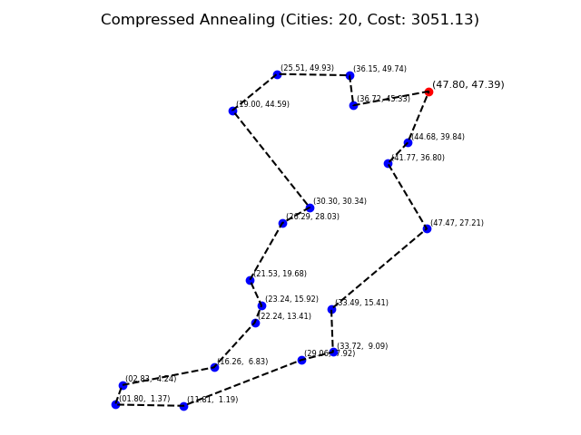
</div>

```bash
tsplot -n 20 -s 2 -g tsptw compressed-annealing
```

### A Comprehensive Study of the Travelling Salesman Problem

For a more exhaustive analysis of the problem and the algorithms presented, feel free to check out our [paper](https://github.com/billsioros/computational-geometry/blob/master/Project/report/report.pdf).

## License


The project is licensed under the [MIT License](http://opensource.org/licenses/MIT):

Copyright &copy; 2020 [Vasileios Sioros](https://github.com/billsioros)

Permission is hereby granted, free of charge, to any person obtaining a copy of this software and associated documentation files (the "Software"), to deal in the Software without restriction, including without limitation the rights to use, copy, modify, merge, publish, distribute, sublicense, and/or sell copies of the Software, and to permit persons to whom the Software is furnished to do so, subject to the following conditions:

The above copyright notice and this permission notice shall be included in all copies or substantial portions of the Software.

THE SOFTWARE IS PROVIDED "AS IS", WITHOUT WARRANTY OF ANY KIND, EXPRESS OR IMPLIED, INCLUDING BUT NOT LIMITED TO THE WARRANTIES OF MERCHANTABILITY, FITNESS FOR A PARTICULAR PURPOSE AND NONINFRINGEMENT. IN NO EVENT SHALL THE AUTHORS OR COPYRIGHT HOLDERS BE LIABLE FOR ANY CLAIM, DAMAGES OR OTHER LIABILITY, WHETHER IN AN ACTION OF CONTRACT, TORT OR OTHERWISE, ARISING FROM, OUT OF OR IN CONNECTION WITH THE SOFTWARE OR THE USE OR OTHER DEALINGS IN THE SOFTWARE.
