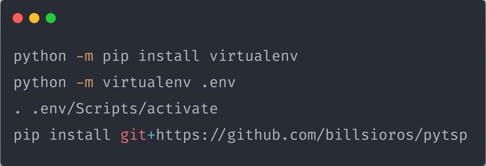
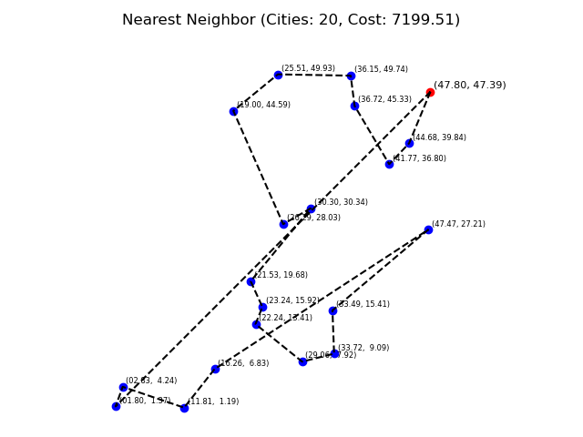
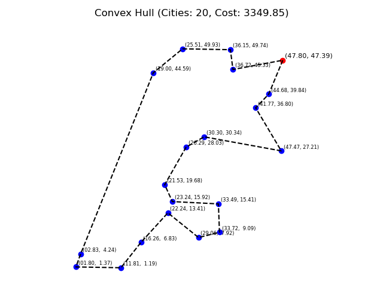
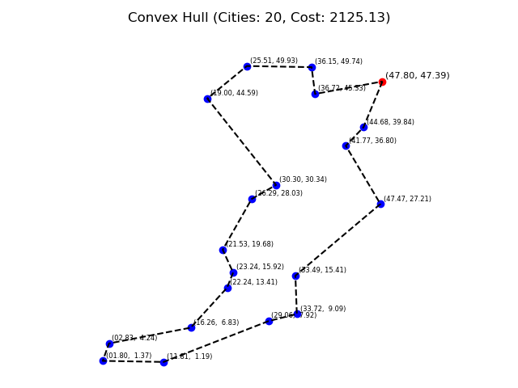
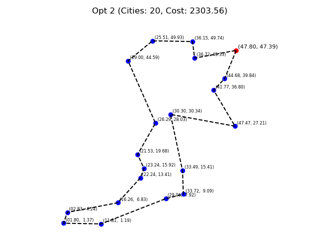
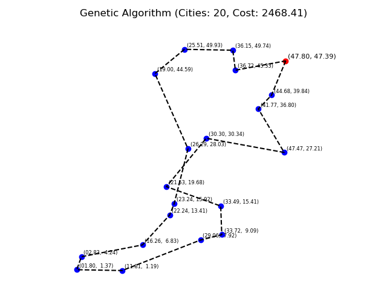
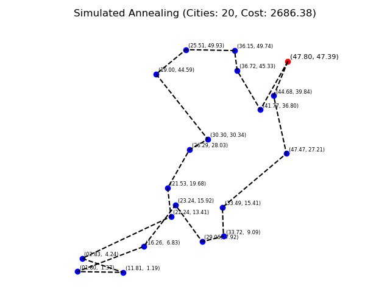
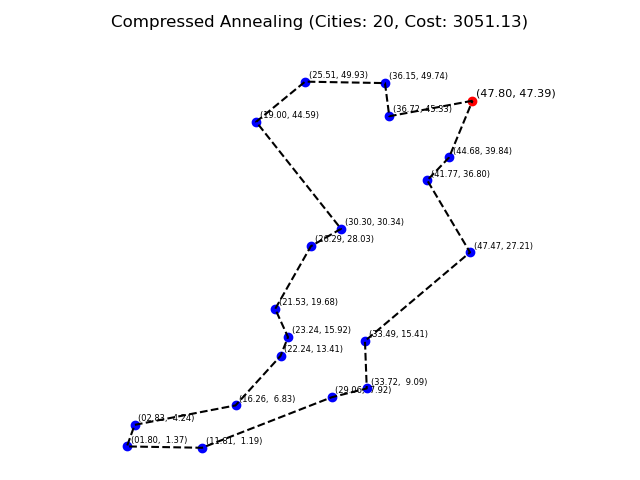

<p align="center">
  
  
  
  
  
  
</p>

# The Travelling Salesman Problem in Python

- [The Travelling Salesman Problem in Python](#the-travelling-salesman-problem-in-python)
  - [Purpose](#purpose)
  - [Overview](#overview)
  - [Installation](#installation)
  - [Introduction](#introduction)
  - [Examples](#examples)
    - [A toy Travelling Salesman Problem](#a-toy-travelling-salesman-problem)
    - [A Simulated Annealing approach to sorting a list of numbers](#a-simulated-annealing-approach-to-sorting-a-list-of-numbers)
    - [A Genetic Algorithm approach to guessing a string](#a-genetic-algorithm-approach-to-guessing-a-string)
  - [Command Line Interface](#command-line-interface)
  - [Theoretical Background](#theoretical-background)
    - [Greedy Approaches](#greedy-approaches)
      - [Nearest Neighbor Search](#nearest-neighbor-search)
    - [Convex hull / Geometric Approaches](#convex-hull--geometric-approaches)
      - [Angle Comparison](#angle-comparison)
      - [Eccentricity Comparison](#eccentricity-comparison)
    - [Local Search Approaches](#local-search-approaches)
      - [2-opt](#2-opt)
    - [Meta-heuristic Approaches](#meta-heuristic-approaches)
      - [Genetic Algorithm](#genetic-algorithm)
      - [Simulated Annealing](#simulated-annealing)
      - [Compressed Annealing](#compressed-annealing)
    - [A Comprehensive Study of the Travelling Salesman Problem](#a-comprehensive-study-of-the-travelling-salesman-problem)

## Purpose

**[pytsp](./pytsp/)** aims at tackling the Travelling Salesman Problem in Python.

_What is the Travelling Salesman Problem ?_

- The travelling salesman problem (TSP) asks the following question: "Given a list of cities and the distances between each pair of cities, what is the shortest possible route that visits each city and returns to the origin city?"
- TSP can be modelled as an undirected weighted graph, such that cities are the graph's vertices, paths are the graph's edges, and a path's distance is the edge's weight. It is a minimization problem starting and finishing at a specified vertex after having visited each other vertex exactly once.

_If you are interested in the intricate inner workings of the different algorithms mentioned above, feel free to check out the [theoretical background](#theoretical-background) section._

## Overview

The project consists of

- the **[pytsp](./pytsp/)** library, which provides different approaches in tackling the Travelling Salesman Problem (with and without Time Windows). These include
  - Greedy approaches
    - [Nearest Neighbor Search](./pytsp/core/tsp.py#L118)
  - Convex hull / Geometric approaches
    - [Angle Comparison](./pytsp/core/tsp.py#L151)
    - [Eccentricity Comparison](./pytsp/core/tsp.py#L151)
  - Local Search approaches
    - [2-opt](./pytsp/core/tsp.py#L176)
  - Meta-heuristic approaches
    - [Genetic Algorithm](./pytsp/core/genetic.py#L8)
    - [Simulated Annealing](./pytsp/core/annealing.py#L17)
    - [Compressed Annealing](./pytsp/core/annealing.py#L64)

- the **[tsplot](pytsp/tsplot.py#L68)** command line utility, which can be used to demonstrate, compare and chain the various algorithms mentioned above.

## Installation



## Introduction

_What is a **Model** ?_

A **[Model](./pytsp/core/misc/model.py#L41)**, in the context of **pytsp**, describes a set of distinctive qualities (_traits_) of each algorithm that can be inherited and / or assigned.

_What are **Traits** ?_

**[Traits](./pytsp/core/misc/model.py#L42)** provide a frictionless way of modifying the inner workings of the underlying algorithms.

_Could you guess what the following python code will produce as output ?_

```python
from pytsp import Model


class Greet(Model):
    class Traits:
        class Greet:
            def greetings(self, name):
                return f'Greetings {self.title}{name}'

            def hello(self, name):
                return f'Hello {self.title}{name}'

    def __init__(self, title, *args, **kwargs):
        super().__init__(*args, **kwargs)

        self.title = title


def good_evening(self, name):
    return f'Good evening {self.title}{name}'


if __name__ == '__main__':
    greet = Greet('Mr.', greet='hello')

    print(greet.greet('Sioros'))

    greet.title = 'Sir.'
    greet.greet = 'greetings'

    print(greet.greet('Vasileios'))

    greet.title = ''
    greet.greet = good_evening

    print(greet.greet('Vasilis'))
```

If you answered

  Hello Mr.Sioros
  Greetings Sir.Vasileios
  Good evening Vasilis

you have earned yourself a cookie !

## Examples

Let's now look at some examples of using **pytsp**. The examples are presented in least to most confusing order.

_The following examples are simplified versions of a subset of the examples provided in the **[examples](./pytsp/examples/)** directory._

### A toy Travelling Salesman Problem

```python
from random import uniform

from pytsp import TravellingSalesman

if __name__ == '__main__':
    x_axis, y_axis = (-50, +50), (-50, +50)

    cities = [
        (uniform(x_axis[0], x_axis[1]), uniform(y_axis[0], y_axis[1]))
        for i in range(10)
    ]

    depot, cities = cities[0], cities[1:]

    tsp = TravellingSalesman(metric='euclidean')

    route, cost = tsp.nearest_neighbor(depot, cities)
```

### A Simulated Annealing approach to sorting a list of numbers

```python
from random import choice, random, randrange, shuffle

from pytsp import SimulatedAnnealing


class Sort(SimulatedAnnealing):
    class Traits:
        class Mutate:
            def shift_1(self, elements):
                neighbor = elements[:]

                i = randrange(0, len(elements))
                j = randrange(0, len(elements))

                neighbor.insert(j, neighbor.pop(i))

                return neighbor

        class Cost:
            def ordered(self, individual):
                mispositioned = 0
                for i in range(0, len(individual) - 1):
                    for j in range(i + 1, len(individual)):
                        mispositioned += individual[i] > individual[j]

                return mispositioned


if __name__ == '__main__':
    sorter = Sort(mutate='shift_1', cost='ordered')

    individual = list(range(10))

    shuffle(individual)

    best, cost = sorter.fit(individual)
```

### A Genetic Algorithm approach to guessing a string

```python
from random import choice, random, randrange
from string import printable

from pytsp import GeneticAlgorithm


class GuessString(GeneticAlgorithm):
    class Traits:
        class Mutate:
            def randomize(self, individual):
                return ''.join([
                    choice(printable)
                    if random() < self.per_character_mutation_probability
                    else individual[i]
                    for i in range(len(individual))
                ])

        class Crossover:
            def cut_and_stitch(self, individual_a, individual_b):
                left = individual_a[:len(individual_a) // 2]
                right = individual_b[len(individual_b) // 2:]

                return left + right

        class Select:
            def random_top_half(self, population):
                return population[randrange(0, len(population) // 2)]

        class Fitness:
            def least_squares(self, individual):
                squared_sum = 0
                for i in range(len(self.target)):
                    squared_sum += (ord(individual[i]) - ord(self.target[i])) ** 2

                return 1 / (squared_sum + 1)

    def __init__(self, target, *args, per_character_mutation_probability=0.1, **kwargs):
        super().__init__(*args, **kwargs)

        self.target = target
        self.per_character_mutation_probability = per_character_mutation_probability


if __name__ == '__main__':
    target = 'Hello World!'

    string_guesser = GuessString(
        target,
        mutate='randomize',
        crossover='cut_and_stitch',
        select='random_top_half',
        fitness='least_squares',
        max_iterations=10000
    )

    individual = ''.join([choice(printable)for _ in range(len(target))])

    fittest = string_guesser.fit(individual)
```

## Command Line Interface

**tsplot** offers a way of demonstrating, comparing and chaining different algorithms.


## Theoretical Background

_Special thanks to [Andrinopoulou Christina](https://github.com/ChristinaAndrinopoyloy) for her major contribution in the theoretical research of the problem._

### Greedy Approaches

#### Nearest Neighbor Search



### Convex hull / Geometric Approaches

#### Angle Comparison



#### Eccentricity Comparison



### Local Search Approaches

#### 2-opt



### Meta-heuristic Approaches

#### Genetic Algorithm



#### Simulated Annealing



#### Compressed Annealing



### A Comprehensive Study of the Travelling Salesman Problem

For a more exhaustive analysis of the problem, feel free to check out our [paper](https://github.com/billsioros/computational-geometry/blob/master/Project/report/report.pdf).
