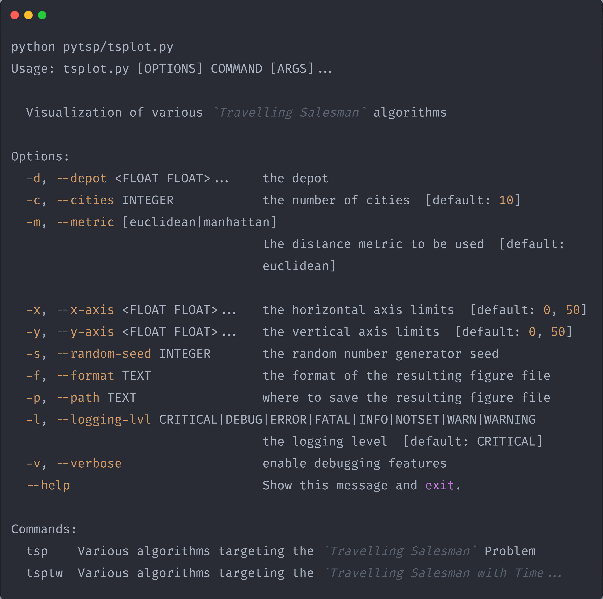

  
  
  
  

# The Travelling Salesman Problem in Python

- [The Travelling Salesman Problem in Python](#the-travelling-salesman-problem-in-python)
  - [What is the Travelling Salesman Problem](#what-is-the-travelling-salesman-problem)
  - [Overview](#overview)
  - [Installation](#installation)

## What is the Travelling Salesman Problem

* The travelling salesman problem (TSP) asks the following question: "Given a list of cities and the distances between each pair of cities, what is the shortest possible route that visits each city and returns to the origin city?"
* TSP can be modelled as an undirected weighted graph, such that cities are the graph's vertices, paths are the graph's edges, and a path's distance is the edge's weight. It is a minimization problem starting and finishing at a specified vertex after having visited each other vertex exactly once.

## Overview

The project consists of:

- the **[pytsp](pytsp/__init__.py)** library, which provides different approaches in tackling the Travelling Salesman Problem (with and without Time Windows). These include:
  - Greedy approaches:
    - Nearest Neighbor Search
  - Convex hull / Geometric approaches:
    - Angle Comparison
    - Eccentricity Comparison
  - Local search approaches:
    - 2-opt
  - Metaheuristic approaches:
    - Genetic Algortithm
    - Simulated Annealing
    - Compressed Annealing
- the **[tsplot](pytsp/tsplot.py)** command line utility, that demonstrates the inner workings of the aforementioned approaches.

## Installation

